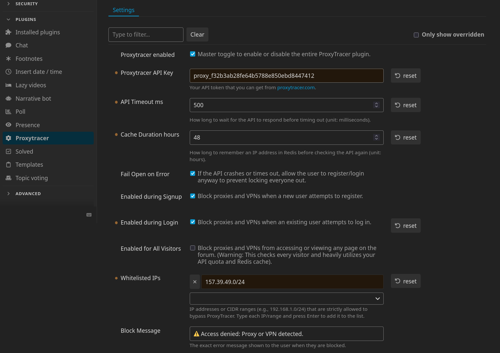

# ProxyTracer for Discourse

The official [ProxyTracer](https://proxytracer.com/) integration for Discourse. This plugin brings enterprise-grade IP intelligence to your community, automatically detecting known VPNs, proxies, datacenters and Tor nodes and giving you the option of preventing them from registering, or logging in, or even from viewing your Discourse forum entirely.

## Features

* Granular control allowing administrators to enforce IP validation during new user registrations, existing user authentication, or globally for all site visitors.
* Built-in Redis caching stores recent IP address evaluations, drastically reducing external API calls and ensuring zero latency.
* In the event of an API timeout or network failure, the plugin prioritizes user access to prevent wide-scale lockouts. This behavior can be changed through the options.
* Built-in support for exact IP and CIDR subnet whitelisting.

## Installation

1. Access your server via SSH and navigate to your Discourse directory:
   ```bash
   cd /var/discourse
   ```

2. Open your container configuration file for editing:
   ```bash
   nano containers/app.yml
   ```

3. Locate the `hooks` section and append the repository clone command directly below the `docker_manager` installation:
   ```yaml
   hooks:
     after_code:
       - exec:
           cd: $home/plugins
           cmd:
             - git clone https://github.com/discourse/docker_manager.git
             - git clone https://github.com/proxytracer/discourse-proxytracer.git
   ```

4. Save the configuration file and rebuild your Discourse container to compile the plugin:
   ```bash
   ./launcher rebuild app
   ```

## Configuration

1. Procure a standard API key from the [ProxyTracer Dashboard](https://proxytracer.com/dashboard).
2. Navigate to your Discourse administration panel: **Admin → Plugins → ProxyTracer** to find ProxyTracer's settings.
3. Input your API key into the `ProxyTracer API Key` field.
4. Enable the protection parameters by toggling `Enabled during Signup`, `Enabled during Login` and/or `Enabled for All Visitors`.
5. Add any trusted IPs or CIDR ranges to the `Whitelisted IPs` list.
6. (Optional) Adjust the API timeout and Redis cache duration limits to suit your server's specific traffic requirements.
7. (Optional) Customize the Block Message that appears to blocked users. For instance, you can add instructions for contacting the administration of the site in case they believe that the block isn't warranted and that they're not accessing the site through a proxy or VPN.

<p align="center">
  
</p>

## Network Configuration: Cloudflare & Reverse Proxies

> [!IMPORTANT]
> **For ProxyTracer to function effectively, the Discourse application must receive the true client IP address.** If your infrastructure utilizes Cloudflare or another reverse proxy, Discourse may default to logging the proxy node's IP address thus making ProxyTracer's job unreliable.

Please follow the configuration guidelines below that match your server's architecture to ensure accurate IP forwarding.

### Direct Cloudflare Integration (Standard Installation)

This applies if your Discourse server connects directly to the internet and utilizes Cloudflare exclusively for DNS and edge proxying. In this standard setup, you must configure Discourse to trust Cloudflare's IP ranges and extract the true client IP from the incoming headers.

1. Connect to your server via SSH and edit your container configuration:
   `nano /var/discourse/containers/app.yml`
2. Locate the `templates:` block and append the official Cloudflare template `templates/cloudflare.template.yml`:
   ```yaml
   templates:
     - "templates/postgres.template.yml"
     - "templates/redis.template.yml"
     - "templates/web.template.yml"
     - "templates/web.ratelimited.template.yml"
     - "templates/cloudflare.template.yml"
   ```
3. Save the file and rebuild the Discourse container to apply the changes:
   `./launcher rebuild app`

### Multi-Layer Proxy Architecture (Cloudflare + Local Reverse Proxy)

This applies if your Discourse instance is routed through a local server management panel or reverse proxy (e.g., CloudPanel, Nginx Proxy Manager, Traefik, Plesk) which sits behind Cloudflare. In a multi-layer (or "double") reverse proxy architecture, the standard Discourse `cloudflare.template.yml` will fail because the traffic is handed to Discourse by your local network interface, not directly by Cloudflare. **Do not use the Cloudflare template in this scenario.**

Instead, you must configure your local reverse proxy to extract the true client IP from the `CF-Connecting-IP` header, **but only for traffic originating from trusted Cloudflare IP addresses**. Blindly passing this header without verifying the source allows malicious users to bypass rate limits and bans by spoofing their IP address.

**Nginx Example:**
First, define Cloudflare's IP ranges as trusted proxies in your server block configuration (outside of your location block):

```nginx
# IPv4 Cloudflare IPs, see https://www.cloudflare.com/ips/
set_real_ip_from 173.245.48.0/20;
set_real_ip_from 103.21.244.0/22;
set_real_ip_from 103.22.200.0/22;
set_real_ip_from 103.31.4.0/22;
set_real_ip_from 141.101.64.0/18;
set_real_ip_from 108.162.192.0/18;
set_real_ip_from 190.93.240.0/20;
set_real_ip_from 188.114.96.0/20;
set_real_ip_from 197.234.240.0/22;
set_real_ip_from 198.41.128.0/17;
set_real_ip_from 162.158.0.0/15;
set_real_ip_from 104.16.0.0/13;
set_real_ip_from 104.24.0.0/14;
set_real_ip_from 172.64.0.0/13;
set_real_ip_from 131.0.72.0/22;

# IPv6 Cloudflare IPs
set_real_ip_from 2405:b500::/32;
set_real_ip_from 2405:8100::/32;
set_real_ip_from 2803:f800::/32;
set_real_ip_from 2c0f:f248::/32;
set_real_ip_from 2a06:98c0::/29;

real_ip_header CF-Connecting-IP;
```

Next, locate your `location /` or `@reverse_proxy` directive. Because of the configuration above, Nginx will now safely resolve `$remote_addr` to the true client IP only if the request actually passed through Cloudflare. Modify your IP forwarding headers as follows:

```nginx
location / {
    proxy_set_header X-Real-IP $remote_addr;
    proxy_set_header X-Forwarded-For $proxy_add_x_forwarded_for;

    ...    
}
```

Save the configuration and reload your host's Nginx service. A Discourse container rebuild is not required for this step.

### Validation and Testing
To verify that your networking configuration is successfully passing the correct data to ProxyTracer:

1. Navigate to your Discourse administrative dashboard: **Admin → Users**.
2. Review the `Registration IP` or `Last IP` columns for recent activity.
   * **Incorrect Setup:** If you observe Cloudflare IPs (see [here](https://www.cloudflare.com/ips/) for a full list) or local network IPs (e.g., `127.0.0.1`, `172.x.x.x`), IP forwarding is failing. ProxyTracer cannot protect your site in this state.
   * **Correct Setup:** If you observe standard, unique residential IP addresses, your network architecture is configured correctly and ProxyTracer is actively monitoring your traffic.

### Emergency Access 

> [!TIP]
> **Locked out?** If you accidentally block your own IP address while configuring ProxyTracer (e.g., you are currently connected to a VPN), you can regain access by disabling the plugin via SSH:
>
> ```bash
> cd /var/discourse
> ./launcher enter app
> rails c
> SiteSetting.proxytracer_enabled = false
> exit
> exit
> ```

## License

This software is licensed under the GNU Affero General Public License v3.0 (AGPLv3). See the `LICENSE` file for full details.
